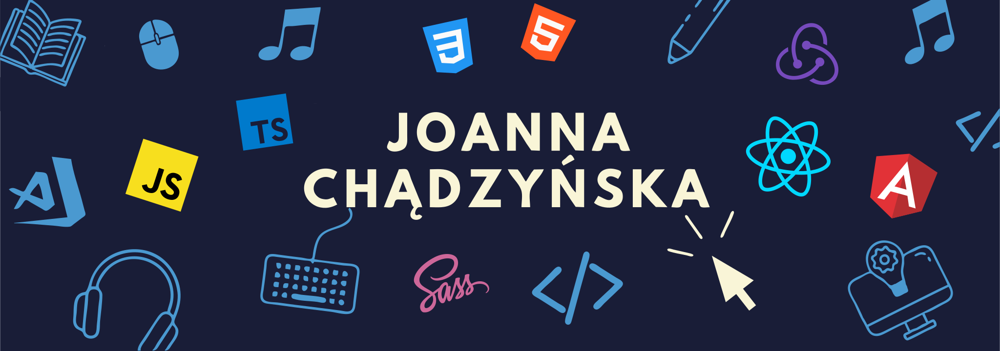
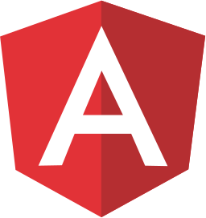

<!-- add link to portfolio page -->

<h1 align="center">Hi 👋, I'm Joanna</h1>
<h3 align="center">A passionate frontend developer from Poland</h3>
 

  

  

-   💬 Ask me about **react**

-   📫 How to reach me **joanna.chadzynska87@gmail.com**

<h3 align="left">Connect with me:</h3>

<!-- CODEPEN -->

<!-- DEV.TO -->
<!--  -->
<!-- TWITTER -->

<!-- LINKEDIN -->

<!-- STACKOVERFLOW -->

<!-- CODESANDBOX -->

<!-- DRIBBLE -->
<!--  -->
<!-- MEDIUM -->
<!-- 

 -->

<h3 align="left">Languages and Tools:</h3>

<!-- JS -->
 
 <!-- TS -->
 
 <!-- REACT -->
 
 <!-- ANGULAR -->
 
 <!-- REDUX -->
 
 <!-- HTML -->

<!-- CSS -->

<!-- SCSS -->

<!-- BOOTSTRAP -->

<!-- WEBPACK -->
 
 <!-- GRAPHQL -->
 
<!-- MONGO DB -->
  
<!-- FIREBASE -->

<!-- POSTMAN -->

<!-- GATSBY JS -->
<!--  -->
<!-- BABEL -->
<!-- <a href="https://babeljs.io/" target="_blank"> -->
<!-- 
</a> -->
 <!-- GULP -->
 <!--  -->
 <!-- EXPRESS JS -->
<!--  -->
<!-- JEST -->
<!--  -->
<!-- GIT -->

<!-- HEROKU -->
<!--     -->
<!-- FIGMA -->
 
 <!-- ADOBE XD -->

 <!-- ADOBE ANIMATE -->

<!-- NETLIFY -->

<!-- DOCKER -->
<!--  -->

 

<!--
**Joanna-Chadzynska/Joanna-Chadzynska** is a ✨ _special_ ✨ repository because its `README.md` (this file) appears on your GitHub profile.

Here are some ideas to get you started:

- 🔭 I’m currently working on ...
- 🌱 I’m currently learning ...
- 👯 I’m looking to collaborate on ...
- 🤔 I’m looking for help with ...
- 💬 Ask me about ...
- 📫 How to reach me: ...
- 😄 Pronouns: ...
- ⚡ Fun fact: ...
-->
